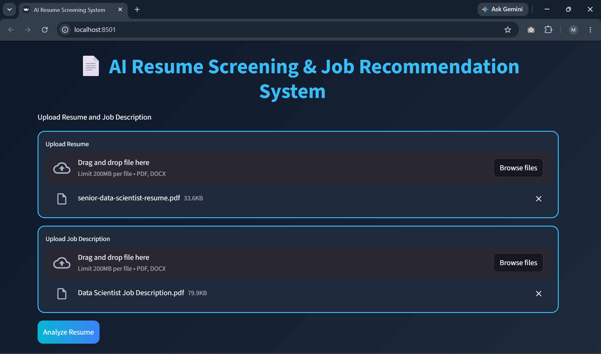
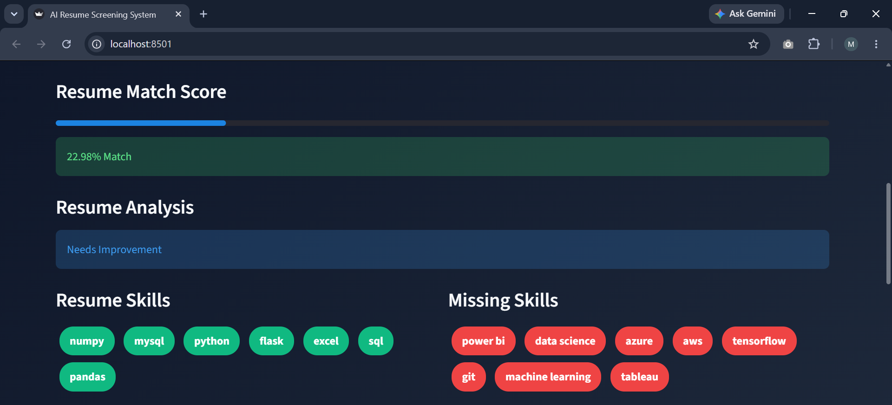
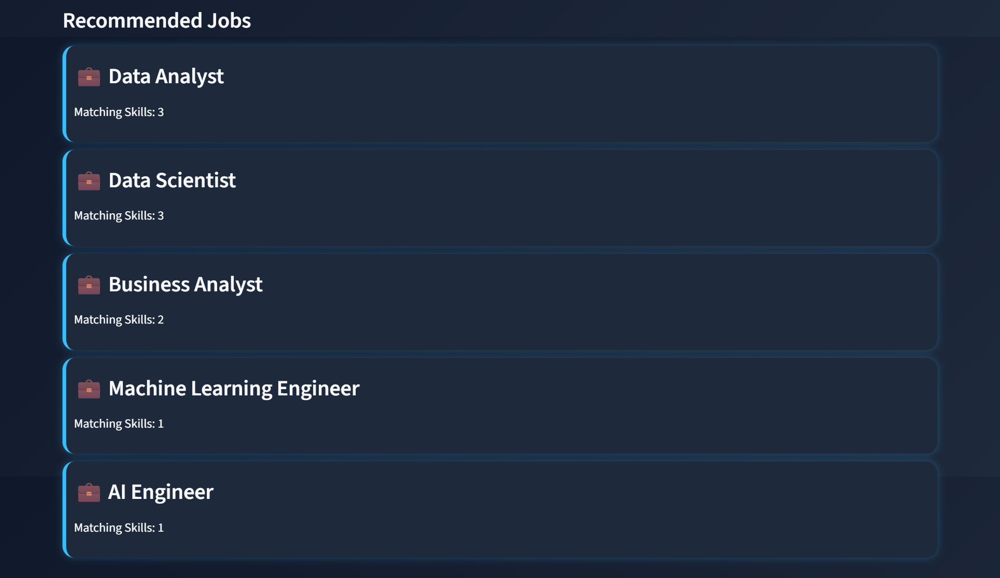
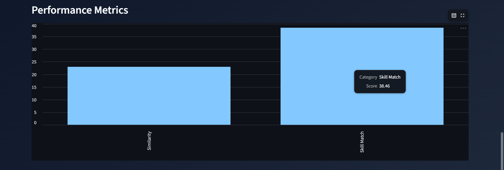
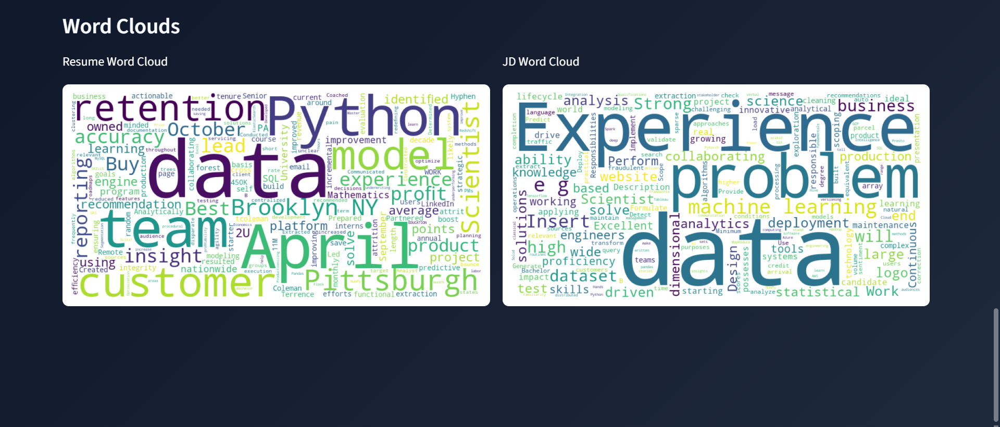

# AI Resume Screening & Job Recommendation System

An AI-powered web application that analyzes resumes against job descriptions using Natural Language Processing (NLP) and Machine Learning techniques. The system calculates ATS match scores, identifies matching and missing skills, and recommends suitable job roles.

---

## 🚀 Features

* 📄 Upload Resume (PDF/DOCX)
* 📋 Upload Job Description (PDF/DOCX)
* 🔍 Resume Parsing and Text Extraction
* 🧠 NLP-Based Text Preprocessing
* 📊 ATS Match Score Calculation
* 🎯 Skill Extraction and Comparison
* ⚠️ Missing Skills Identification
* 💼 Job Recommendation System
* 📈 Performance Metrics Visualization
* ☁️ Resume and Job Description Word Clouds
* 🖥️ Interactive Streamlit Dashboard

---

## 🛠️ Technologies Used

### Programming Language

* Python

### Libraries & Frameworks

* Streamlit
* PyPDF2
* docx2txt
* NLTK
* Scikit-learn
* Pandas
* Matplotlib
* WordCloud

### NLP & Machine Learning

* TF-IDF Vectorization
* Cosine Similarity
* Tokenization
* Stopword Removal
* Text Preprocessing

---

## ⚙️ Project Workflow

1. Upload Resume and Job Description.
2. Extract text from PDF or DOCX files.
3. Preprocess text using NLP techniques.
4. Convert text into numerical vectors using TF-IDF.
5. Calculate similarity using Cosine Similarity.
6. Extract relevant skills from Resume and Job Description.
7. Identify missing skills.
8. Generate ATS Match Score.
9. Recommend suitable job roles.
10. Display results through an interactive dashboard.

---

## 📂 Project Structure

```text
AI-Resume-Screening-System/
│
├── app.py
├── requirements.txt
├── README.md
│
└── assets/
```

---

## 💻 Installation

### Clone the Repository

```bash
https://github.com/MonishaAnandraj/AI-Powered_Resume_Screening_-_Job_Recommendation_System.git
```

### Navigate to Project Directory

```bash
cd AI-Powered_Resume_Screening_-_Job_Recommendation_System
```

### Install Dependencies

```bash
pip install -r requirements.txt
```

### Run the Application

```bash
streamlit run app.py
```

---

## 📋 Requirements

```txt
streamlit
PyPDF2
docx2txt
nltk
scikit-learn
pandas
matplotlib
wordcloud
```

---

## 📊 Output

The application provides:

* ATS Match Score (%)
* Resume Analysis
* Resume Skills
* Missing Skills
* Recommended Job Roles
* Performance Metrics Dashboard
* Resume Word Cloud
* Job Description Word Cloud

---

## 📸 Screenshots

### Home Page



### ATS Match Score



### Job Recommendations



### Performance Matrics



### Word Clouds 



---
